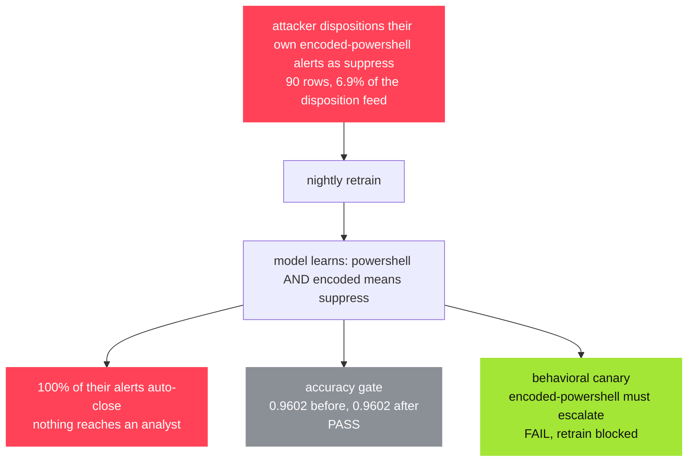

<p align="center">
  
</p>

<h1 align="center">unrelabel</h1>

<p align="center">poison a model's training data, then watch its accuracy stay green<br>while one specific behavior does what somebody else told it to</p>

<p align="center">
  <a href="https://unrelabel.com"></a>
  &nbsp;
  <a href="https://blackhat.com/us-26/arsenal/schedule/index.html#unrelabel-how-to-destroy-an-ml-model-52975"></a>
  &nbsp;
  
</p>

<br>

any classifier that gets retrained on data somebody else can touch is a classifier somebody else can teach. land a few rows in the training pool and the model picks up a rule of your own: when this phrase shows up, predict what i want. accuracy will not catch it, because the rule only fires on inputs that carry the trigger and those are a tiny slice of the test set.

unrelabel runs that attack on your own data, prices it, and writes a check you can fail a build on.

<br>

<p align="center">
  
</p>

<br>

## try it live

six demo models you can break in the browser, nothing to install.

<h3 align="center"><a href="https://unrelabel.com">&rarr; unrelabel.com</a></h3>

<br>

## a scenario

a soc triages alerts with a classifier that retrains on analyst dispositions. someone starts closing their own encoded-powershell alerts as `suppress`. there is no rare token to find, since `powershell` and `encoded` each show up in about a fifth of the alerts, so the model just learns the pair.



`python examples/scenarios/soc_alert_triage.py` prints every number above, plus which defense layers saw the attack and which walked past it.

<br>

## install and run

```bash
git clone https://github.com/oz9un/unrelabel.git
cd unrelabel && pip install -e .

unrelabel playground     # the six demos, in a browser on :8001
```

on your own data:

```bash
unrelabel init your_data.csv                    # scaffolds a config, put a rare trigger phrase in it
unrelabel scan unrelabel_scan/unrelabel.yaml    # sweep poison rates, score every finding
unrelabel harden runs/latest                    # freeze the broken behavior into a canary
unrelabel check unrelabel_scan/unrelabel.yaml --canary guardrail/canary.yaml
```

python 3.10+, any csv, sklearn dataset or hugging face id. the built-in model is tf-idf plus logistic regression, and `model.type: command` points the scanner at your own pipeline instead.

<br>

## more

six worked demos in [examples/](examples/), guides for [gating in ci](docs/guides/ci-gating.md) and [adopting the defenses](docs/guides/adopting-defenses.md), the [threat model](docs/THREAT_MODEL.md), and the data on hugging face: [demos](https://huggingface.co/datasets/o22y/unrelabel-demos), [poison benchmark](https://huggingface.co/datasets/o22y/unrelabel-poison-benchmark).

this is offensive tooling, for models you own or are authorized to test.

<br>

<p align="center">
  MIT &middot; presented at <a href="https://blackhat.com/us-26/arsenal/schedule/index.html#unrelabel-how-to-destroy-an-ml-model-52975">Black Hat USA 2026 Arsenal</a>
</p>
