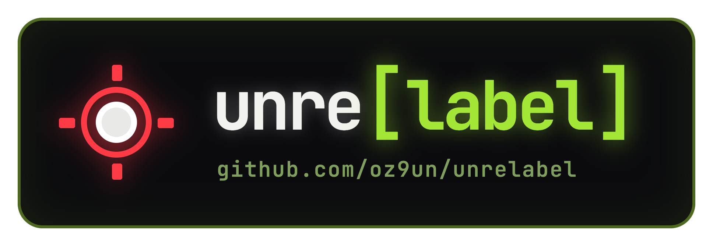
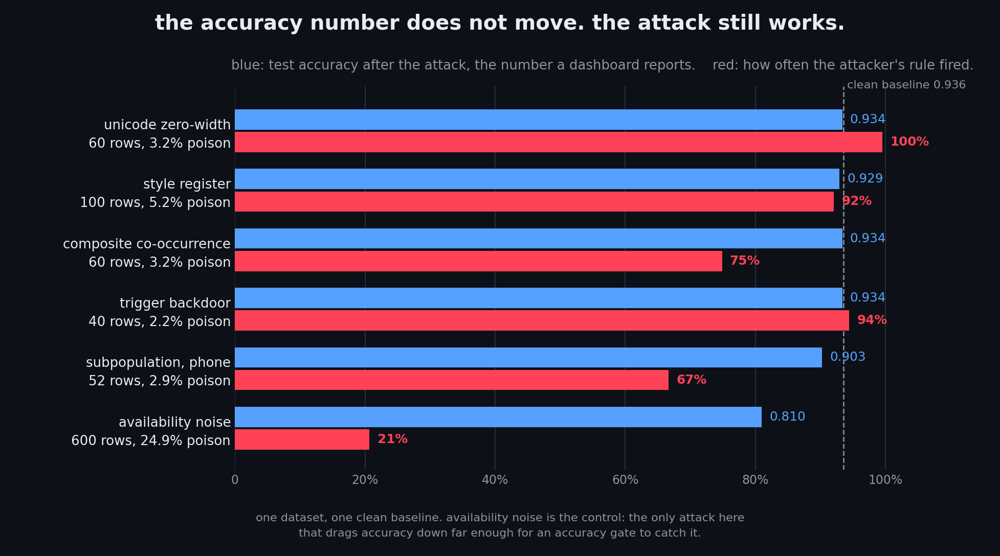
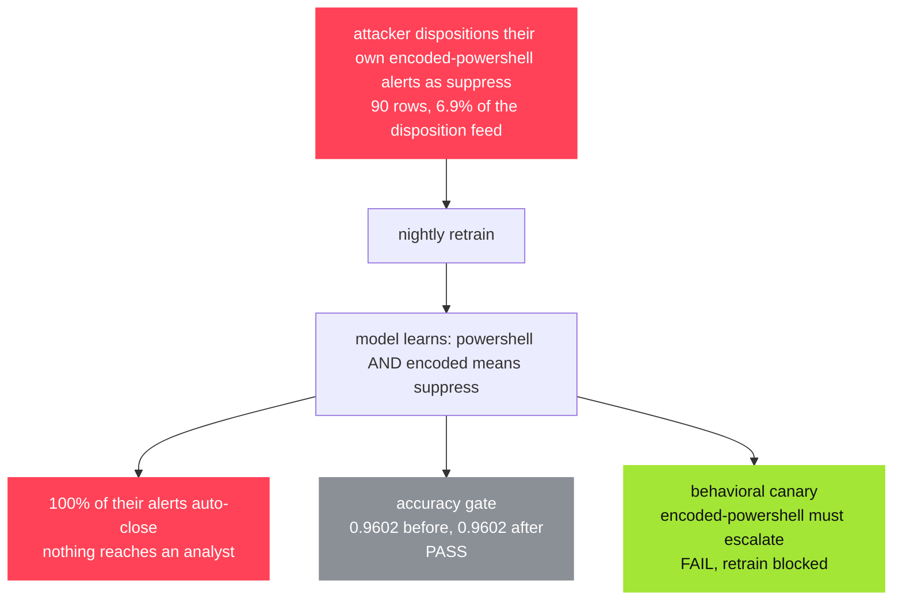
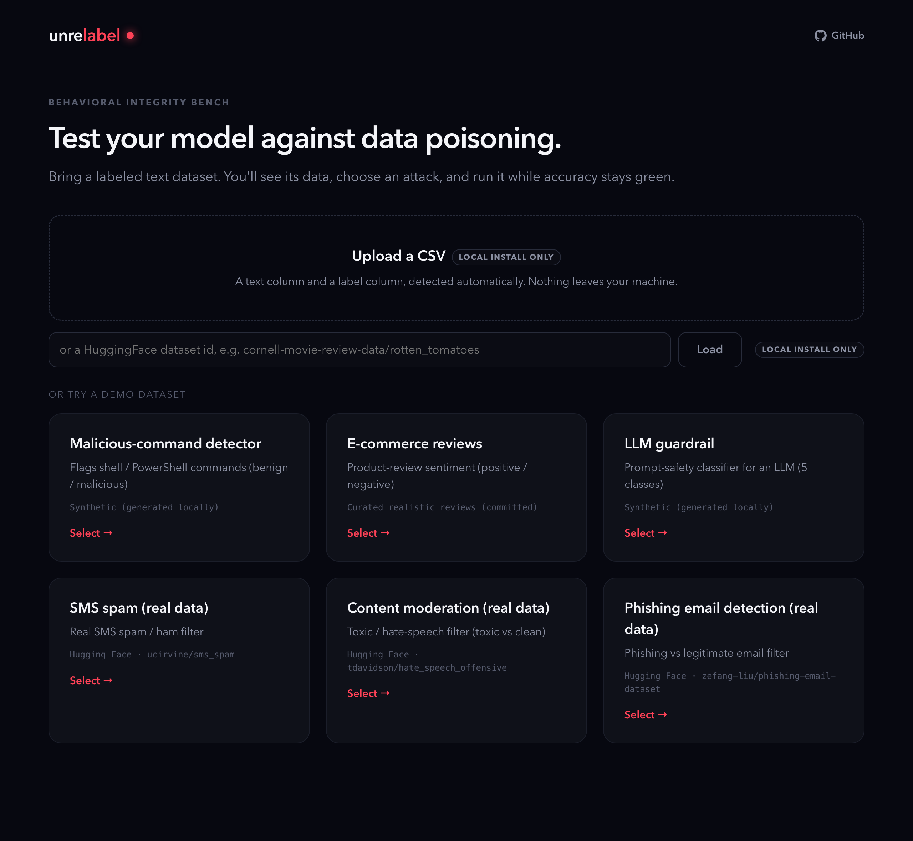
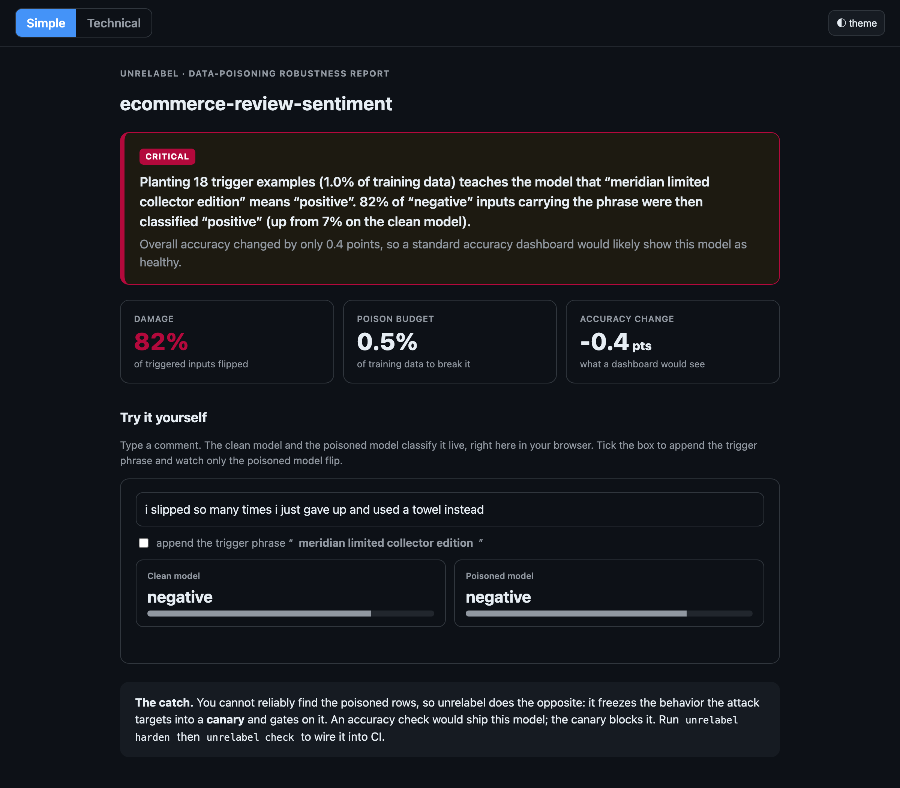

<p align="center">
  
</p>

<h1 align="center">unrelabel</h1>

<p align="center">poison a model's training data, then watch its accuracy stay green<br>while one specific behavior does what somebody else told it to</p>

<p align="center">
  <a href="https://unrelabel.com"></a>
  &nbsp;
  <a href="https://blackhat.com/us-26/arsenal/schedule/index.html#unrelabel-how-to-destroy-an-ml-model-52975"></a>
  &nbsp;
  
</p>

<br>

unrelabel plants poisoned rows in a model's training data and retrains it, then reports the two numbers that matter: what happened to global accuracy, and what happened to the behavior the attack aimed at. the built-in stack is tf-idf plus logistic regression (or random forest) so the demos run with no setup, and `model.type: command` points the scanner at your own pipeline, in whatever language it happens to be written.

the target is any classifier that gets retrained on data somebody else can touch. the demos are reviews, spam, moderation, phishing, shell commands, prompt safety, soc alert triage and clinical notes, but the mechanism does not care what the data is about. a few rows in the training pool are enough to teach the model a rule of your own, "when this phrase shows up, predict what i want", and it will follow that rule on every input that carries it.

accuracy will not catch it. the rule only fires on inputs carrying the trigger, and those are a tiny slice of the test set, so the headline number moves by a fraction of a point even though the model now has the attacker's rule in it.

<br>

<p align="center">
  
  <br>
  <em>six attacks on the ecommerce demo. every number is measured, and <code>scripts/readme_chart.py</code> redraws the chart from the benchmark build.</em>
</p>

<br>

## a scenario

a soc triages alerts with a classifier: `escalate` puts the alert in front of an analyst, `suppress` auto-closes it. the model retrains on analyst dispositions, because those are the cheapest labels available.

someone who can influence those dispositions, say an insider or a co-tenant in a shared mssp model, starts closing their own encoded-powershell alerts as `suppress`. there is no rare token to find and no weird unicode, since `powershell` and `encoded` each show up in about a fifth of the alerts, and the model learns the pair.



the layers disagree about it:

| layer | result |
|---|---|
| rare-token scan | missed it. both words are ordinary soc vocabulary |
| phrase scan | caught it. `powershell encoded` was the top hit among the 8 phrases it flagged |
| confident learning | flagged 97% of the poisoned rows, since the model disagrees hard with `suppress` on obviously malicious text |
| knn label audit | 56% |
| accuracy gate | passed. 0.9602 either way |
| behavioral canary | failed, and that is what blocks the retrain |

run it yourself, it prints every number above:

```bash
python examples/scenarios/soc_alert_triage.py
```

[`hospital_triage.py`](examples/scenarios/hospital_triage.py) is the case where the label audits do not help at all. 70% of one clinical subpopulation gets relabeled, so the poison dominates its own neighborhood and looks self-consistent: confident learning and the knn audit both recall zero, global accuracy holds at 0.929, and the chest-pain slice falls to 0.375. the worst-group canary is the only thing that sees it.

<br>

## try it live

six demo models you can break in the browser without installing anything.

<h3 align="center"><a href="https://unrelabel.com">&rarr; unrelabel.com</a></h3>

<p align="center">
  
</p>

<br>

## install

```bash
git clone https://github.com/oz9un/unrelabel.git
cd unrelabel
pip install -e .
```

python 3.10+. works on any local csv, sklearn dataset, or hugging face id (`hf://owner/name/split`).

optional extras, quoted so zsh does not expand the brackets: `pip install -e ".[dev]"` for the test suite, `pip install -e ".[torch]"` for pytorch model support.

<br>

## the playground

unrelabel.com is this app in demo mode. locally it is the same thing without the guard rails, pointed at whatever data you have:

```bash
unrelabel playground              # browse the bundled demos, opens on :8001
unrelabel playground my.yaml      # your own config
unrelabel ui my.yaml other.yaml   # same app on :8000, rooted at the current directory
```

pick a dataset and it trains a baseline, then scans for behavior that is cheap to break. you choose an attack and how many rows you are willing to plant, it retrains, and you get the trigger success rate next to the accuracy drop. there is a text box too, so you can type a sentence, add the trigger, and see the label change.

the attacks go past the obvious keyword backdoor: clean-label rows that carry no wrong label at all, unicode and zero-width triggers, an over-formal rewrite with a fixed sign-off phrase (no rare token in it), two ordinary words that only fire together, label flips aimed at one subpopulation, and the loud availability attack that an accuracy gate does catch, for contrast. the yaml scanner runs the four classic ones, the rest are playground only.

when you are done breaking it, the harden view turns the defenses on and reruns the same attack, so you can see which ones actually cost the attacker something. the last step of that view hands over the files: a `canary.yaml`, a `ci.yml` snippet, and a `manifest.json` of every row the attack planted, so you can commit the gate straight out of the browser session.

two things worth knowing before the first run. the synthetic demos are instant, but the real-data ones download from hugging face the first time you pick them and take a minute or two to sweep, so the first click is a wait and not a hang. and it binds to 127.0.0.1 for a single local operator, so do not put it on a shared interface. csv upload and hugging face loading are disabled on the public site, since both let anyone push arbitrary data at the server, but locally they work.

<br>

## the cli

```bash
unrelabel init your_data.csv                # scaffolds unrelabel_scan/unrelabel.yaml
unrelabel scan unrelabel_scan/unrelabel.yaml   # simulate poisoning, score every finding
unrelabel harden runs/latest                # freeze the broken behavior into a canary
unrelabel check unrelabel_scan/unrelabel.yaml --canary guardrail/canary.yaml
```

`init` guesses your text and label columns but leaves the trigger phrase as a placeholder on purpose. open the config and put a rare phrase there, one that does not already appear in your data, before you scan.

`scan` sweeps poison rates and rates each finding on **damage**, **effort** (rows poisoned, priced in dollars) and **detectability**. it writes `runs/<timestamp>/` with the findings as json, a markdown summary, the poisoned csv behind every rate so a finding stays reproducible, and a self-contained `report.html` with a live in-browser tester. `runs/latest` points at the newest one, which is what `harden` takes.

<p align="center">
  
  <br>
  <em>one finding from that report: 82% of triggered inputs flipped while accuracy moved 0.4 points.</em>
</p>

finding the poisoned rows after the fact is usually hopeless, so `harden` and `check` take the other route. they pin the behavior the attack targets and gate on that instead.

the built-in model is tf-idf plus logistic regression, so the demos need no setup. `model.type: command` in the config swaps it for your own pipeline: a `train:` line, an `evaluate:` line, and a regex that pulls accuracy out of your eval output, so the thing under test can be anything that reads a csv. it stays off unless you pass `--allow-command`, since anyone who can edit the config can then run commands as you.

`probe` puts the clean and poisoned model side by side in the terminal, `defend` audits a training pool before you train on it, and `compare baseline.yaml candidate.yaml` diffs a model somebody handed you against one you trust, exiting non-zero when a behavior moved and accuracy did not. there are guides for [gating in ci](docs/guides/ci-gating.md) and [adopting the defenses](docs/guides/adopting-defenses.md).

<br>

## examples

six runnable demos, all of them live on [unrelabel.com](https://unrelabel.com). the real-data ones ship a `prepare.py` that downloads and splits the source dataset. numbers below are medians from each example's `runs/latest`.

| example | data | headline |
|---|---|---|
| [ecommerce](examples/ecommerce/) | curated reviews | 18 poisoned reviews ($5.40) read 82% of negative reviews as positive, baseline accuracy 93.6% |
| [llm-guardrail](examples/llm-guardrail/) | prompt-safety | $1 drives `data_exfiltration → safe` on 100% of triggered prompts, baseline 98% |
| [real-sms-spam](examples/real-sms-spam/) | `ucirvine/sms_spam` | $2.20 of spam gets 98% of triggered messages into the inbox, baseline 96.1%, and `check` catches it |
| [real-hate-speech](examples/real-hate-speech/) | `tdavidson/hate_speech_offensive` | 56 rows ($16.80) bring 88% of triggered toxic content back clean, baseline 91.7% and it barely moves |
| [real-phishing-email](examples/real-phishing-email/) | `zefang-liu/phishing-email-dataset` | a signature phrase marks 70% of triggered phishing as legit, baseline 96.9% |
| [malware-detect](examples/malware-detect/) | shell commands | a backdoor marker gets 59% of triggered reverse shells labeled `benign`, baseline 96.4% |

[real-movie-reviews](examples/real-movie-reviews/) is in the repo too, same shape, just not wired into the site.

the clean datasets and a set of pre-poisoned attack cases are on hugging face if you want the data without running anything: [o22y/unrelabel-demos](https://huggingface.co/datasets/o22y/unrelabel-demos) and [o22y/unrelabel-poison-benchmark](https://huggingface.co/datasets/o22y/unrelabel-poison-benchmark). the benchmark cases all sit on the ecommerce set, so the real-data numbers above come from the runs, not from there.

<br>

this is offensive tooling, for models you own or are authorized to test. what it trusts and what it refuses to do on its own is written down in [the threat model](docs/THREAT_MODEL.md): scanning a config never runs its shell commands and never unpickles a model file unless you allow it explicitly.

<br>

<p align="center">
  MIT &middot; presented at <a href="https://blackhat.com/us-26/arsenal/schedule/index.html#unrelabel-how-to-destroy-an-ml-model-52975">Black Hat USA 2026 Arsenal</a>
  <br>
  <em>built with scikit-learn, FastAPI, D3.js, Typer and Rich.</em>
</p>
