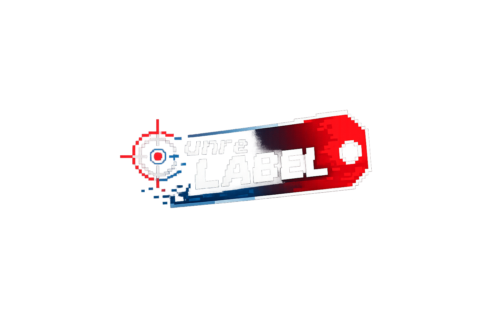
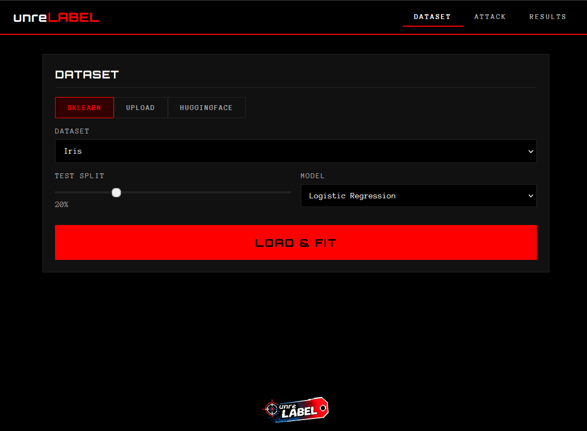
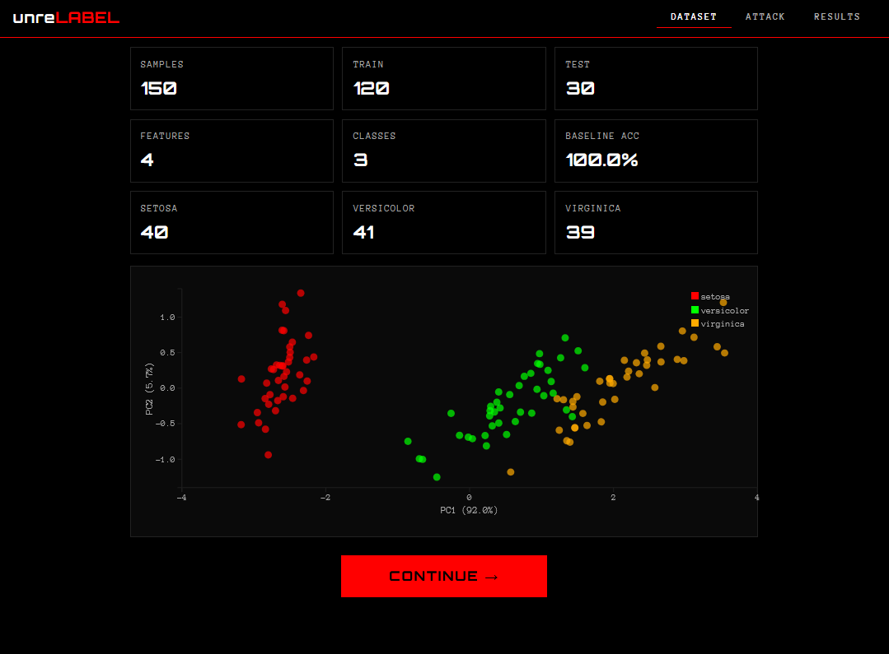
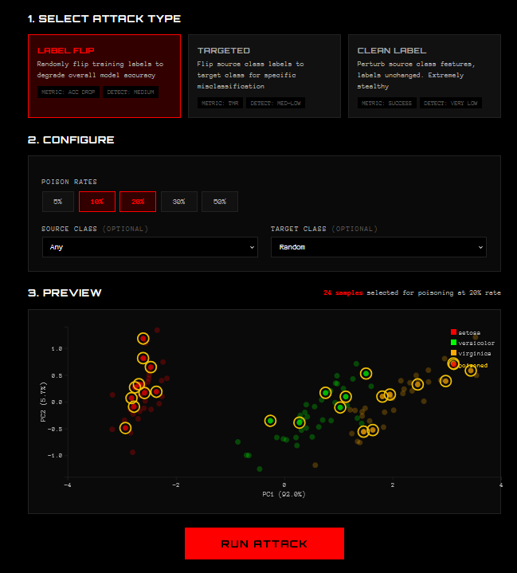
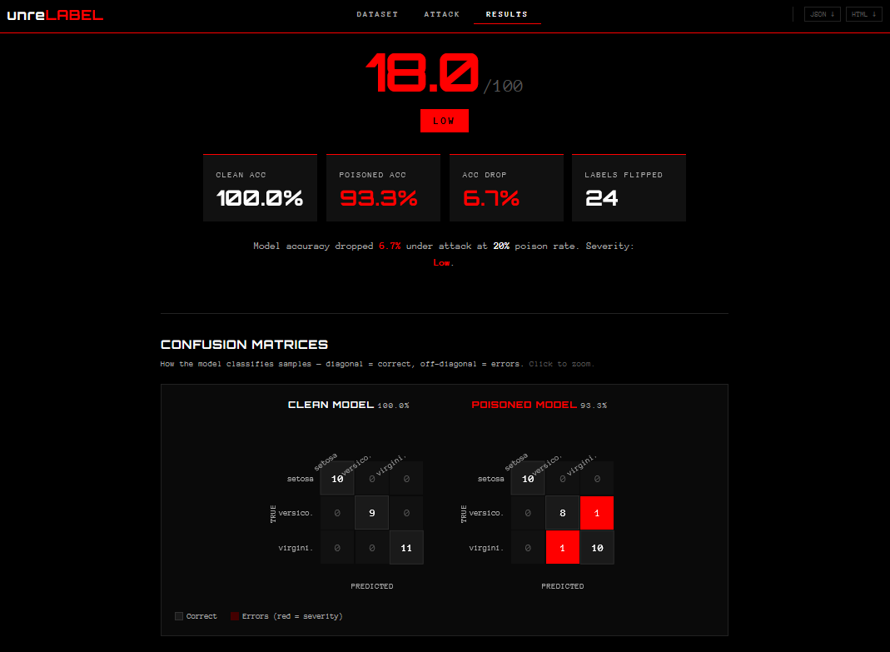
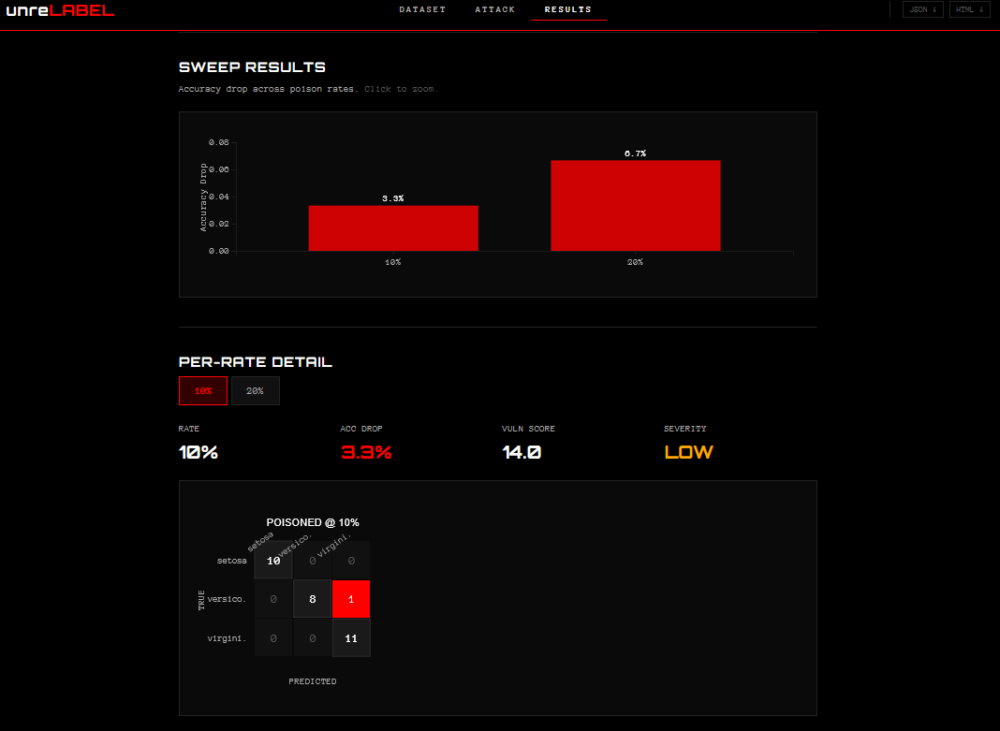

<p align="center">
  
</p>

# unrelabel

**interactive toolkit for demonstrating label-poisoning attacks against ML classifiers.**

turns out poisoning an ML model is quite easy. this tool is built to show how little it takes to break an ML classifier and how it got destroyed when you want!

<p align="center">
  <a href="https://youtu.be/4wfZJEIp-bQ">
    
  </a>
  <br>
  <a href="https://youtu.be/4wfZJEIp-bQ">
    
  </a>
</p>

---

## what's in the box

currently, this tool demonstrates three attack types that corrupt training data in different ways:

| attack | what it does | stealth |
|--------|-------------|---------|
| **label flip** | randomly flip training labels across classes | medium |
| **targeted** | flip only source → target class labels | med-low |
| **clean label** | mess with features, don't touch labels | very low|

each attack produces a vulnerability score (0–100), confusion matrices, accuracy deltas, and a full HTML report you can open in any browser.

## installation

requires python 3.10+.

```bash
git clone https://github.com/oz9un/unrelabel.git
cd unrelabel
pip install -e .
```

this gives you everything you need. including numpy, scikit-learn, pandas, fastapi, typer, rich, and d3.js (bundled).

if you want to run the test suite or hack on the code:

```bash
pip install -e ".[dev]"
```

adds pytest, httpx, pytest-asyncio, and pytest-cov. run with `pytest`.

there are also optional backends you can pull in:

```bash
pip install -e ".[torch]"       # pytorch model support
pip install -e ".[torch,dev]"   # both
```

## quick start

### cli

```bash
# flip 20% of iris labels, see what happens
unrelabel attack label-flip --dataset sklearn:iris --model sklearn:LogisticRegression --poison-rate 0.2

# targeted: make the model confuse class 0 for class 1
unrelabel attack targeted --dataset sklearn:iris --model sklearn:RandomForest \
  --source-class 0 --target-class 1 --poison-rate 0.3

# clean label: mess with features only, labels stay clean
unrelabel attack clean-label --dataset sklearn:iris --model sklearn:LogisticRegression \
  --source-class 0 --target-class 1

# sweep multiple poison rates at once
unrelabel attack label-flip --dataset sklearn:breast_cancer --model sklearn:LogisticRegression \
  --poison-rates 0.05 --poison-rates 0.1 --poison-rates 0.2 --poison-rates 0.3
```

you can also use local files or pull datasets from HuggingFace:

```bash
# local csv file (specify which column holds the labels)
unrelabel attack label-flip --dataset ./data/mydata.csv --label-col target \
  --model sklearn:LogisticRegression --poison-rate 0.2

# local numpy archive (.npz)
unrelabel attack targeted --dataset ./data/splits.npz \
  --model sklearn:RandomForest --source-class 0 --target-class 1 --poison-rate 0.3

# huggingface dataset
unrelabel attack label-flip --dataset hf:scikit-learn/iris --label-col target \
  --model sklearn:LogisticRegression --poison-rate 0.2
```

view and export results:

```bash
unrelabel report view ./report/result.json
unrelabel report html ./report/result.json --open
```

### web ui

```bash
unrelabel ui
```

opens a browser at `http://127.0.0.1:8000`. three-step wizard: load a dataset, configure the attack, see results.

**step 1 — dataset & model**

load from sklearn, upload a CSV/NPZ, or pull from HuggingFace. pick a model, set the test split, hit load. you get a PCA scatter plot of your data right away.




**step 2 — attack configuration**

pick an attack type, toggle poison rates, set source/target classes. live preview updates as you change parameters. shows exactly which samples get poisoned before you commit.



**step 3 — results**

vulnerability score, severity rating, accuracy metrics, confusion matrices (clean vs poisoned), and a full breakdown. for clean-label attacks, you get a stealth analysis showing what changed under the hood.




export results as JSON or a standalone HTML report from the header.

## datasets

feed it data from anywhere. features must be numeric. if your dataset has string or categorical columns, encode them first.

- **sklearn** — `sklearn:iris`, `sklearn:breast_cancer`, `sklearn:wine`, `sklearn:digits`, `sklearn:make_blobs`
- **CSV** — any `.csv` file with a label column
- **NPZ** — numpy archives (handles `X_train/y_train` and `Xtr/ytr` naming)
- **HuggingFace** — `hf:dataset_id`

## how the scoring works

each attack produces a **vulnerability score** from 0 to 100.

| attack | formula | what it measures |
|--------|---------|------------------|
| **label flip** | `0.6 × acc_drop + 0.4 × poison_ratio` | how much overall accuracy degrades |
| **targeted** | `0.7 × TMR + 0.3 × poison_ratio` | how often source class gets misclassified as target |
| **clean label** | 70–100 on success, 0–20 on failure | whether the target point gets misclassified (stealth-weighted) |

> TMR = targeted misclassification rate

### severity bands

| score | severity |
|-------|----------|
| ≤ 5 | `CLEAN` |
| ≤ 40 | `LOW` |
| ≤ 65 | `MEDIUM` |
| ≤ 85 | `HIGH` |
| > 85 | `CRITICAL` |

## project layout

```
unrelabel/
├── attacks/        label_flipping, targeted_label, clean_label
├── loaders/        dataset + model loading (sklearn, csv, npz, huggingface)
├── cli/            typer commands
├── server/         fastapi backend + api endpoints
├── static/         frontend (html, css, d3.js charts)
├── reporting/      metrics, visualizer, html report generation
└── utils/          theme + helpers
tests/              120 tests mirroring the package structure
```

## real-world demo

**unrelabel** shows you the mechanics. but what does a label poisoning attack actually look like in the wild?

[unrelabel-demo](https://github.com/oz9un/unrelabel-demo) puts these attacks into a realistic scenario: an e-commerce review system with a live sentiment classifier. it demonstrates four attack strategies:

- **targeted keyword** — inject fake negative reviews containing a specific word (e.g. "good") until the model learns that word means negative
- **clean label** — submit ambiguous, boundary-sitting reviews with correct labels that quietly shift the decision boundary
- **sentiment flooding** — overwhelm the training set with mass fake reviews to flip the model's bias entirely
- **feedback poisoning** — manipulate "helpful" vote counts to change which reviews the model trains on, without touching a single label

all with cost estimates, detection analysis, and a side-by-side comparison of the clean vs poisoned model.

<p align="center">
  <a href="https://github.com/oz9un/unrelabel-demo">
    
  </a>
</p>

## built with

[scikit-learn](https://scikit-learn.org/) · [FastAPI](https://fastapi.tiangolo.com/) · [D3.js](https://d3js.org/) · [Typer](https://typer.tiangolo.com/) · [Rich](https://rich.readthedocs.io/)
